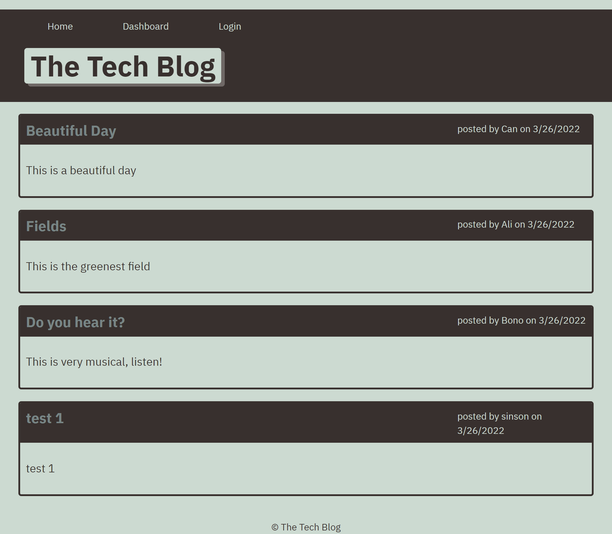

# Musical Chair
  
  ## Table of Contents:
  1. [Description](#Description)
  2. [Built With](#Builtwith)
  3. [Usage](#Usage)  
  4. [Contributing](#Contributing)
  5. [License](#License)
  6. [Question](#Question)
  
## Description
Writing about tech can be just as important as making it. Developers spend plenty of time creating new applications and debugging existing codebases, but most developers also spend at least some of their time reading and writing about technical concepts, recent advancements, and new technologies. A simple Google search for any concept covered in this course returns thousands of think pieces and tutorials from developers of all skill levels!
This is a CMS-style blog site similar to a Wordpress site, where developers can publish their blog posts and comment on other developers’ posts as well. App is following the MVC paradigm in its architectural structure, and uses Handlebars.js as the templating language, Sequelize as the ORM, and the express-session npm package for authentication. It was developed over some starter code and deployed to Heroku.
  
## Built With
* Node.js
* MySql
* JavaScript
* CSS

## Usage

Deployed application link: [teck Blog Heroku](https://...) 

Github Repo: [tech-blog github repo](https://github.com/sasansinson/tech-blog)  

## Contributing
Contributions are what make the open source community such an amazing place to learn, inspire, and create. Any contributions you make are greatly appreciated.  
If you have a suggestion that would make this better, please fork the repo and create a pull request. You can also simply open an issue with the tag "enhancement". Don't forget to give the project a star! Thanks again!  
1. Fork the Project
2. Create your Feature Branch (git checkout -b feature/AmazingFeature)
3. Commit your Changes (git commit -m 'Add some AmazingFeature')
4. Push to the Branch (git push origin feature/AmazingFeature)
5. Open a Pull Request

## License
[MIT License](https://opensource.org/licenses/MIT)  

## Question
 
Email: sasan_2002@yahoo.com  
Github page: [sasansinson](https://github.com/sasansinson)

 

